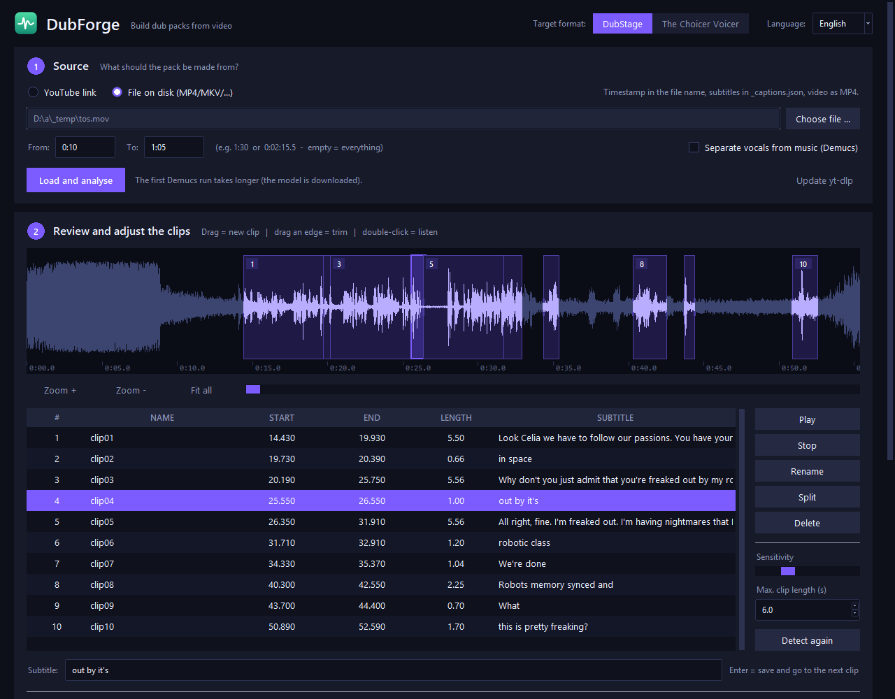
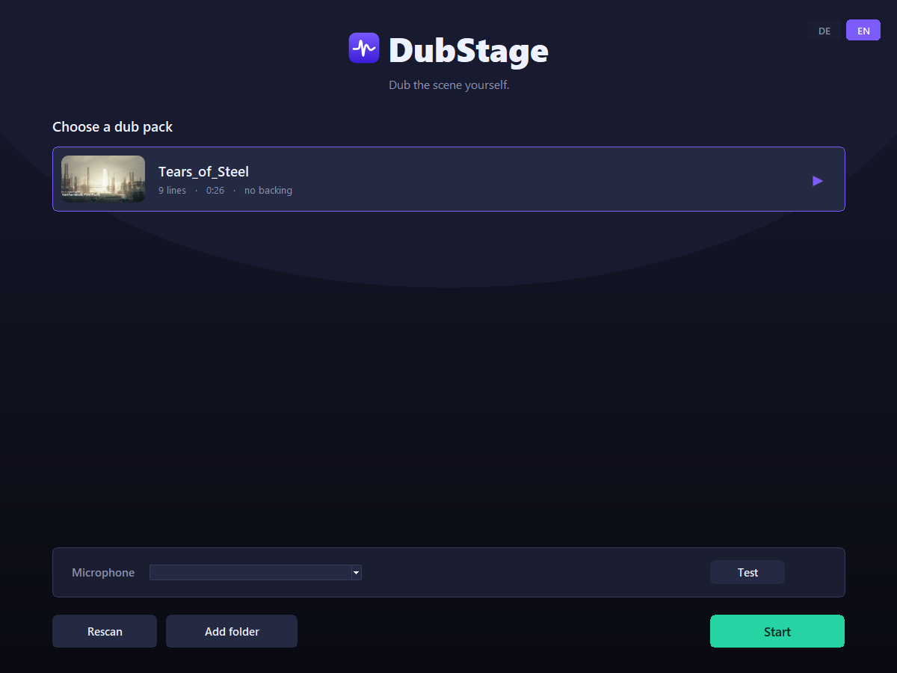
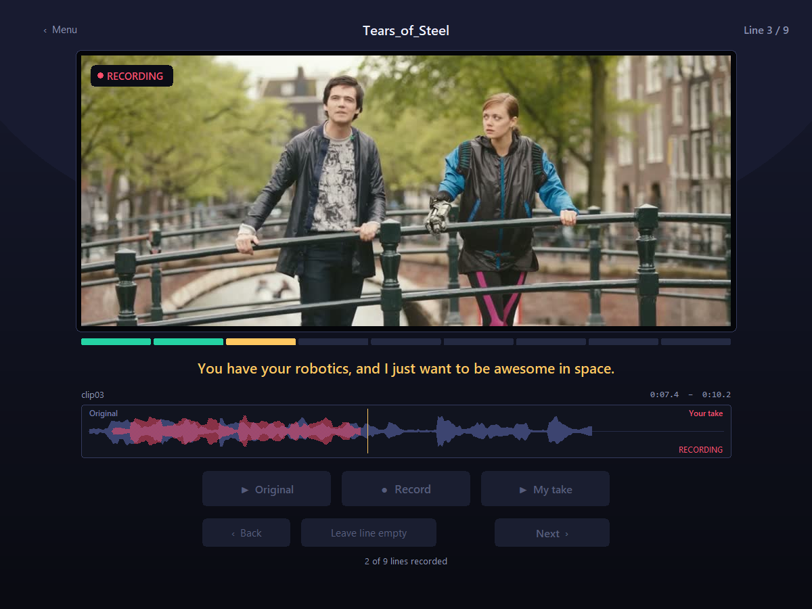
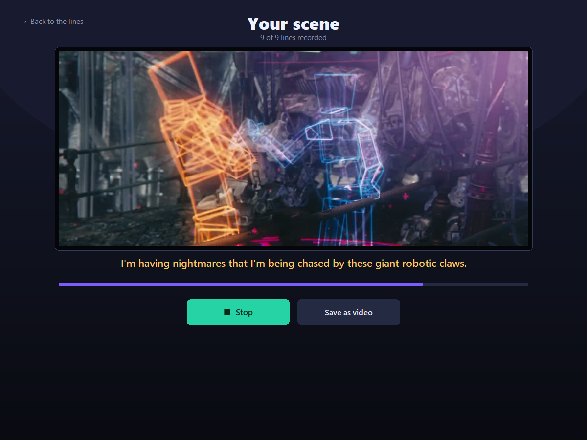

<p align="center">
  <picture>
    <source media="(prefers-color-scheme: dark)" srcset="docs/logo-dark.png">
    
  </picture>
</p>

<p align="center">
  Dub scenes from video yourself — two Windows desktop tools, Python and ffmpeg, no accounts and no cloud.
</p>

---

**DubForge** cuts a video into speakable clips, **DubStage** records your voice line by line and plays the whole scene back with it.

---

## Screenshots

**DubForge** — clip detection, one track per speaker, subtitles



**DubStage** — pick a pack



**DubStage** — recording a line, your take drawn live over the original



**DubStage** — the finished scene in your own voice



<sub>Footage: <i>Tears of Steel</i> — (CC) Blender Foundation | <a href="https://mango.blender.org">mango.blender.org</a>, CC BY 3.0. Captions generated by DubForge's built-in speech recognition.</sub>

## What it does

**DubForge** takes a YouTube link or a local video file, trims it to the span you want, separates the voices from music and noise, and finds the spoken segments on its own. You arrange the clips on a timeline with one track per speaker — overlapping lines simply go on different tracks — add subtitles (typed, from an SRT/VTT file, or fetched from YouTube), and build a pack. Packs can be reopened and edited later, and zipped for [DisDubs](https://github.com/Tann2019/DiscordDubs).

**DubStage** plays a pack line by line. You hear the original, record over it as often as you like, and see your take drawn live on top of the original waveform — so you can tell whether your timing lands. At the end the whole scene plays back in your voice, and you can export it as MP4.

## Install

1. Download the files into one folder
2. Double-click `Start DubForge.bat` (or `Start DubStage.bat`)

That is all. The first start runs the setup by itself — Python packages, ffmpeg
into `tools/`, and desktop shortcuts if you want them — then opens the tool.
Every start after that goes straight to the tool. You can also run `Setup.bat`
on its own if you would rather set up first.

The setup brings its own Python with every package the tools need, downloads
ffmpeg, and creates Start-menu (and optionally desktop) shortcuts. It installs
per user into `%LOCALAPPDATA%\Programs\DubStage`; uninstall it from
*Settings → Apps* like any other program — you are asked whether your packs and
recordings should go too.

Two parts are optional and can be picked in the setup (or added later by
running it again): [Demucs](https://github.com/adefossez/demucs) for vocal
separation, which pulls in PyTorch (up to ~2 GB) — without it you simply get no
backing track — and speech recognition for automatic captions.

Windows SmartScreen may warn about the setup because it is not code-signed:
*More info → Run anyway*.

### Without the installer

For development, or if you prefer your own Python (3.9+): put the files into one
folder, run `Setup.bat`, then `Start DubForge.bat` / `Start DubStage.bat`.

### Building the setup yourself

`installer\build.ps1` builds `dist\DubStage-Setup-<version>.exe` on Windows
with [Inno Setup](https://jrsoftware.org/isinfo.php) 6.3+. GitHub Actions runs
the same script on every push and attaches the setup to each published release.

## Quick start

```
DubForge   →  paste a link, set "From" and "To", "Load and analyse"
           →  name the tracks after the speakers, sort the clips onto them,
              type subtitles, "Build pack"  (or "Zip for DisDubs")
DubStage   →  pick the pack, record line by line, "Done"
```

Packs land in `packs/` next to the tools, which is exactly where DubStage looks.

## What a pack looks like

```
packs/MyScene/
  01_Snake_0-920.wav        clip: speaker (track name) and start time in the file name
  02_Otacon_4-120.wav
  dub_video.mp4             the scene
  _backing_track.wav        music and noise without voices
  _captions.json            subtitles
  _TIMESTAMPS.txt           overview
  _pack_info.ini            title and author
  _dubforge.json            the project - lets DubForge reopen the pack
```

The speaker and the start time sit in the file name (`44-048` = 44.048 s), so a pack stays readable and editable without any database. DisDubs casts its parts from the speaker names. DubStage also accepts `dub_video` as `.ogv`, `.mkv`, `.webm`, `.mov` or `.avi`.

## How it works

Video is never decoded during playback. Each pack is split into JPEG frames once (25 fps at 960 px, cached in `%TEMP%`), which keeps playback smooth and independent of codecs. Audio runs through `sounddevice`; recording and the backing track play simultaneously, and the microphone writes a running envelope so the comparison strip can be drawn live.

Clips are loudness-normalised to −1 dBFS peak. The comparison normalises both curves to their own level, so what you judge is rhythm rather than volume.

## Updates

Both tools check GitHub on start — at most once every six hours — for a newer
release. If there is one, a banner appears that names the version, expands to
show that release's changelog, and can install it: the archive is downloaded and
checked, the app closes, the files are replaced and it starts again. Your
`packs/`, `dubs/`, `tools/` and settings are never touched, and the previous
files are backed up to `%TEMP%` first.

Network access also includes downloading a video you asked for and the initial
download of a speech-recognition model when you generate captions.
Nothing is sent, no account is involved. To switch it off, set
`"check_updates": false` in `dubforge_settings.json` or `dubstage_settings.json`.

## Languages

The interface is available in German and English, switchable at runtime in the top right of either tool.

## Automatic captions

Say yes to the optional speech recognition in `Setup.bat` (run it again to add
it later), or run `py -m pip install -r requirements-transcription.txt`.

After **Load and analyse**, open **Subtitles ▾ → Recognise from the audio
(Whisper)**, enter the spoken language code (`fr` French, `en` English, `de`
German, `zh` Chinese, `ja` Japanese - any Whisper code works), pick a model and
click **Generate captions**. Review and correct the text in the subtitle field,
then build your pack. The text comes out in the spoken language; nothing is
translated.

Recognition uses local [faster-whisper](https://github.com/SYSTRAN/faster-whisper),
defaulting to multilingual `large-v3` for accuracy and CPU/int8 for compatibility.
The model download needs several GB of disk space; CPU processing may take
several minutes or longer. Audio is never uploaded. Separated vocals are used
when Demucs ran. Choose `turbo` or `small` for faster processing.

Only empty subtitles are filled unless **Replace existing subtitles** is ticked.
Moving or trimming clips re-assigns the recognised words; text you corrected by
hand stays. A video pack also gets `dub_video.srt` and `dub_video.vtt` with the
complete transcript (DubStage and DisDubs ignore them).

For a finished pack: `py caption_pack.py packs/Test --language fr`
(`--overwrite` regenerates existing text, replaced files are backed up in
`_caption_backup_*`).

## Reporting a bug

Every session is written to `dubforge.log` next to the program, and the same text is in the collapsible **Log ▾** at the bottom of the window. If something misbehaves, paste the tail of that log with the version from the title bar. Uploads into DisDubs happen from its scene picker — build, **Zip for DisDubs**, then drop the zip there.

## Tests

```
python -m unittest discover tests -v
```

Core tests run anywhere; the ffmpeg- and display-dependent ones (including a full analyse → build → reopen run with playback) skip themselves when ffmpeg or a display is missing.

## Documentation

- [`README_EN.md`](README_EN.md) — full manual in English
- [`LIESMICH.md`](LIESMICH.md) — deutsche Anleitung
- [`CHANGELOG.md`](CHANGELOG.md) — what changed, and why

## Licence

GPL-3.0 — see [LICENSE](LICENSE).

You are responsible for only using material you are entitled to use.
